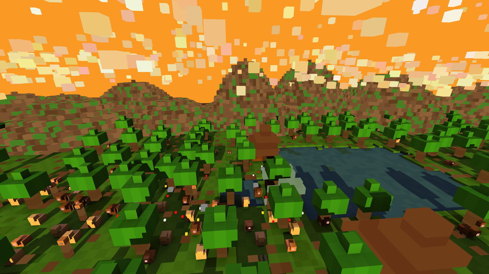
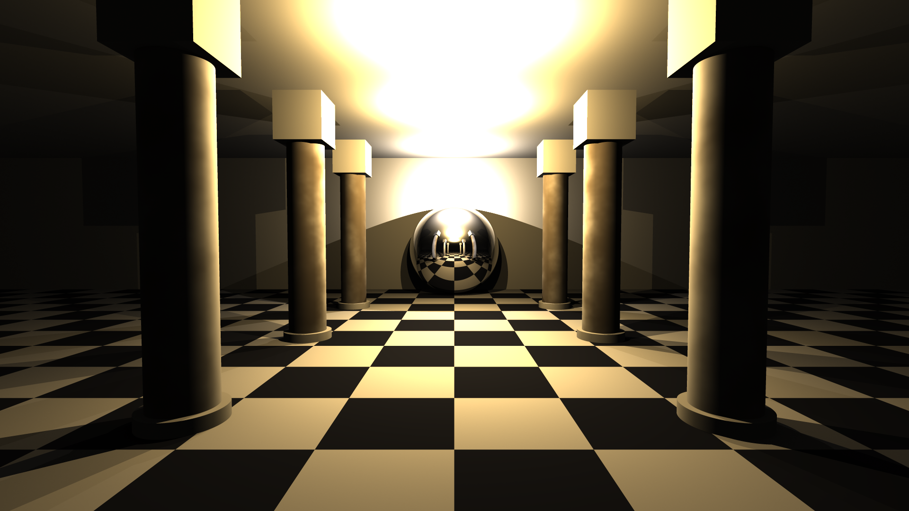
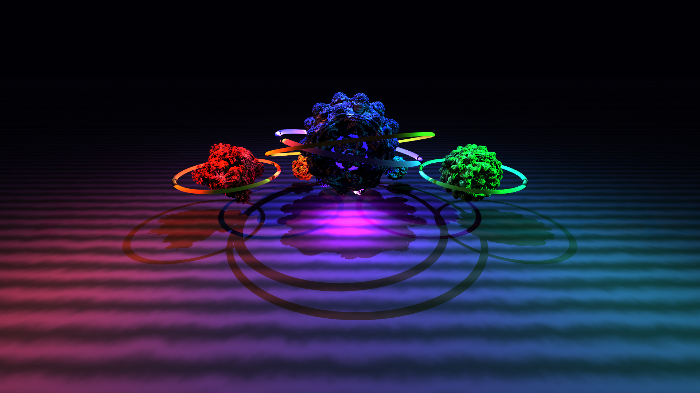
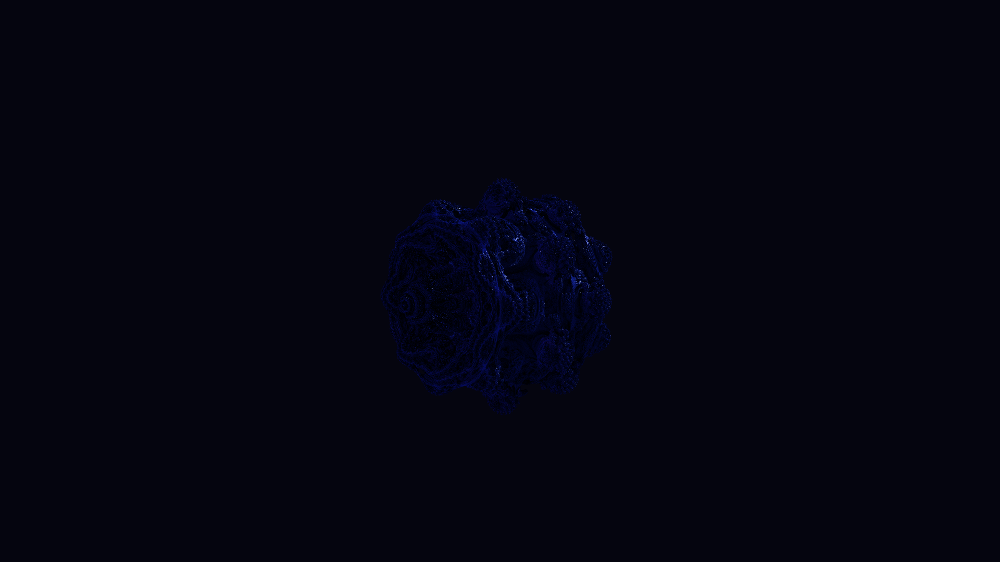
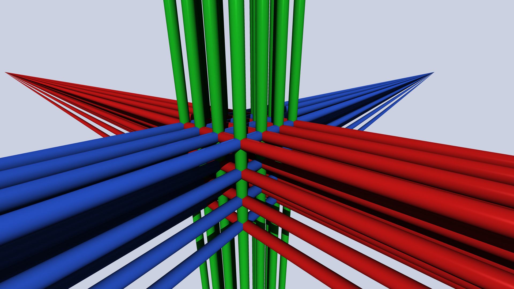
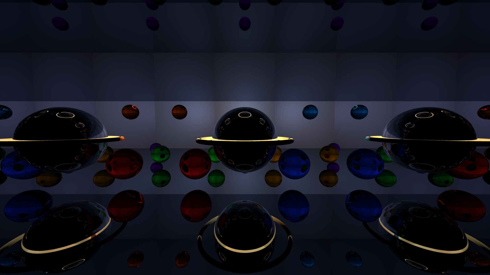
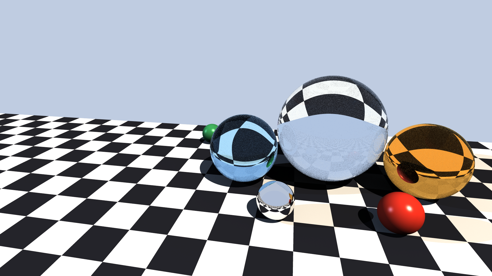
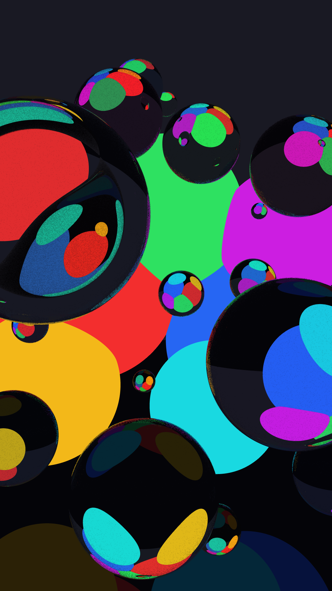
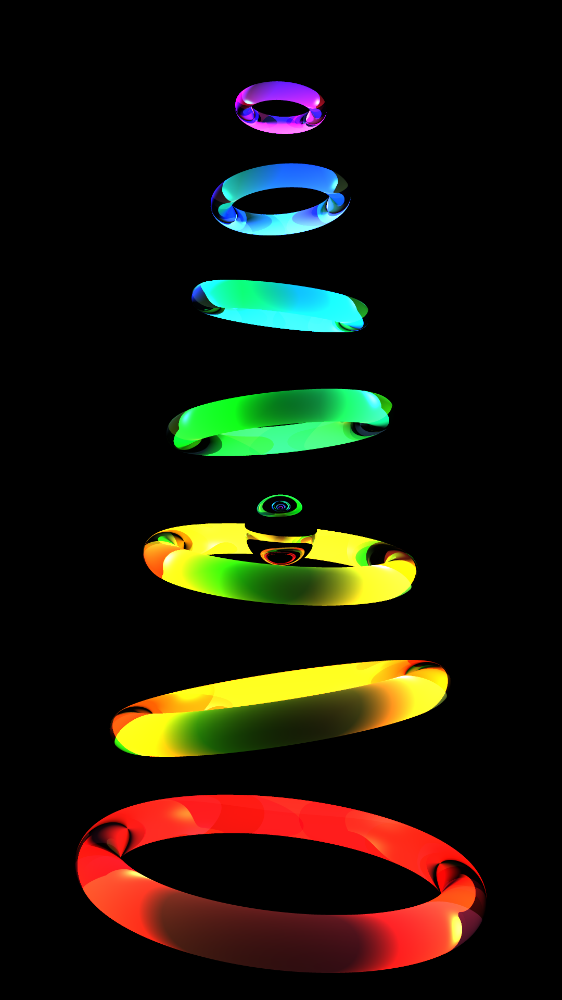
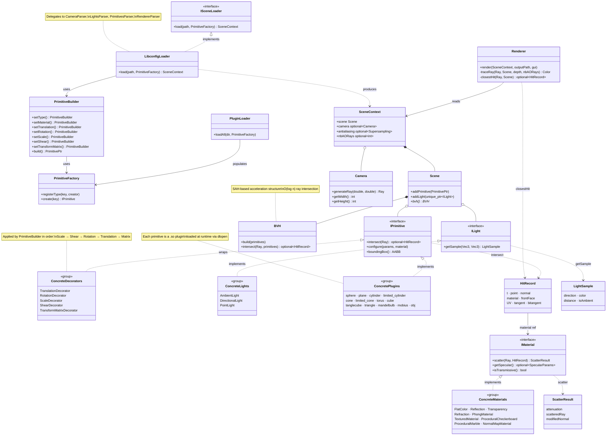

# Raytracer

> Physically-based renderer implementing recursive backward ray tracing, SAH-accelerated BVH, plugin-based primitives, and physically-motivated material models written in C++20.

---

## Table of contents

- [Overview](#overview)
- [Showcase / Demos](#showcase--demos)
- [Compilation](#compilation)
- [Usage](#usage)
- [Project architecture](#project-architecture)
- [Mathematical foundations](#mathematical-foundations)
- [Interfaces](#interfaces)
- [Primitives](#primitives)
- [Materials](#materials)
- [Lights](#lights)
- [Configuration files](#configuration-files)
- [Plugins](#plugins)
- [Tests](#tests)

---

## Overview

**Raytracer** is a physically-based rendering engine that simulates light transport via **recursive backward ray tracing**: rays are cast from the camera into the scene, intersected against scene geometry, and recursively traced at each material interaction point (specular reflection, dielectric refraction, transparency). The algorithm approximates the **rendering equation** (Kajiya, 1986):

$$L(p,\,\omega_o) = L_e(p,\,\omega_o) + \int_\Omega f_r(p,\,\omega_i,\,\omega_o)\,L_i(p,\,\omega_i)\,(\omega_i \cdot \hat{n})\,d\omega_i$$

with one direct-lighting sample per light source, one recursive indirect bounce, and Monte Carlo ambient occlusion over the hemisphere.

| Property | Details |
|---|---|
| Parallelism | OpenMP row-parallel rendering |
| Acceleration | SAH-BVH - $O(\log n)$ expected ray–scene traversal |
| Geometry | Plugin-based (`dlopen`/`dlsym`), 13 primitive types |
| Materials | 9 material models (Phong, dielectric, procedural, texture-mapped) |
| Lights | 3 light types with shadow rays and transmissive color filtering |
| Scene format | `libconfig++` declarative `.cfg` scene description files |
| Standard | C++20, compiled with `-Wall -Wextra -Werror -fopenmp -fPIC` |

Primitives are implemented as **dynamic shared libraries** (`.so`) loaded at run-time via `dlopen`/`dlsym`/`dlclose`. The core binary never links against any primitive directly: everything is dispatched generically through abstract interfaces.

All compiled plugins must be placed in the `./plugins/` directory.

---

## Showcase / Demos
<p align="center">
    
    
</p>
<p align="center">
    
    
</p>
<p align="center">
    
    
</p>
<p align="center">
    
    
</p>
<p align="center">
    
    
</p>

---

## Compilation

```sh
# Compile everything (core binary + all plugins/*.so)
make

# Compile only the core binary
make raytracer

# Clean object files
make clean

# Remove everything (objects + binary + plugins + test binary)
make fclean

# Recompile from scratch
make re

# Install system dependencies (apt)
make install
```

### Tests

```sh
# Run unit tests (Criterion)
make unit_tests

# Run functional tests (bash)
make func_tests

# Run all tests
make tests

# Coverage report (lcov)
make coverage

# Memory check (Valgrind)
make memcheck
```

**Compiler flags**: `-Wall -Wextra -Werror -std=c++20 -fopenmp -fPIC`
**Dependencies**: `libconfig++`, `SFML` (optional GUI), `OpenMP`, `Criterion`

---

## Usage

```sh
./raytracer <scene_file.cfg>        # Render to output/<stem>.ppm
./raytracer --gui <scene_file.cfg>  # Render with live SFML display window
./raytracer --help                  # Show usage
```

The output is written as a PPM P6 binary file in the `output/` directory.
Press `Ctrl+C` during `--gui` rendering to interrupt and save the partially rendered image.

**Error cases:**
- If arguments are missing or invalid, the program prints a usage message and exits with code `84`.
- If the scene file cannot be parsed, an error is printed on stderr and the program exits with code `84`.

```sh
$ ./raytracer ; echo "Exit code: $?"
Error: missing scene file. Use --help for usage.
Exit code: 84
```

**Render a demo scene:**
```sh
./raytracer scenes/demos/demo_sphere.cfg
./raytracer scenes/demos/demo_shadows.cfg
./raytracer --gui scenes/scenes/complex_ambient_occlusion.cfg
```

---

## Project architecture

```
.
├── doc/
│   ├── mathematics.md              # Mathematical reference: ray equations, intersection derivations, lighting
│   ├── raytracer.pdf               # Illustrated reference: schemas, formulas, worked derivations
│   ├── architecture.md             # C++ pseudo-code architecture overview
│   ├── architecture.mmd            # Mermaid class diagram
│   ├── configuration_format.md     # Complete .cfg file format specification
│   ├── adding_a_primitive.md       # Guide: how to add a new primitive plugin
│   ├── adding_a_material.md        # Guide: how to add a new material
│   └── adding_a_light.md           # Guide: how to add a new light source
│
├── include/
│   ├── core/                       # Math types: Vec3, Ray, Color, Mat3, Mat4, AABB, Common
│   ├── interfaces/                 # Abstract bases: IPrimitive, IMaterial, ILight, ISceneLoader
│   ├── lights/                     # Concrete lights: AmbientLight, DirectionalLight, PointLight
│   ├── materials/                  # Concrete materials: FlatColor, Phong, Reflection, Refraction,
│   │                               #   Transparency, Textured, Checkerboard, Marble, NormalMap
│   ├── parser/                     # Scene file parsers: CameraParser, LightsParser,
│   │                               #   PrimitivesParser, RendererParser, MaterialBuilder, etc.
│   ├── plugins/                    # Plugin/factory system: DLLoader, Factory, PluginLoader, Factories
│   ├── rendering/                  # Rendering: Renderer, HitRecord, LightSample, ScatterResult
│   ├── scene/                      # Scene: Scene, Camera, BVH, GroupNode, PrimitiveBuilder, SAHBuilder
│   └── utils/                      # Utilities: PerlinNoise, Decorators, LibconfigLoader, Type
│
├── obj_models/                     # Sample .obj mesh files
├── output/                         # Rendered PPM output images (generated)
├── plugins/                        # Compiled .so files (generated by make)
├── scenes/                         # Example scene .cfg files
│   ├── antialiasing/
│   ├── complex/
│   ├── demos/
│   ├── lights/
│   ├── materials/
│   ├── scenes/
│   ├── tests/
│   └── textures/
├── screenshots/                    # Screenshots of complex scenes
│
├── src/
│   ├── main.cpp                    # Entry point
│   ├── lights/                     # Light implementations
│   ├── materials/                  # Material implementations
│   ├── parser/                     # Parser implementations
│   ├── plugins/                    # Plugin .so sources (sphere, plane, cylinder, etc.)
│   ├── rendering/                  # Renderer implementation
│   ├── scene/                      # Scene, Camera, BVH, GroupNode, PrimitiveBuilder
│   └── utils/                      # PluginLoader, Decorators, PerlinNoise, LibconfigLoader
│
├── tests/
│   ├── functional_tests.sh         # Functional test suite
│   └── unit_tests/                 # Unit tests (Criterion)
│       ├── core/
│       ├── fixtures/               # .cfg fixture files for loader tests
│       ├── lights/
│       ├── materials/
│       ├── plugins/
│       ├── primitives/
│       ├── rendering/
│       ├── scene/
│       └── utils/
│
└── textures/                       # PPM texture images for textured/normalmap materials
```

### Class diagram



---

## Mathematical foundations

The renderer approximates the rendering equation via direct lighting (shadow ray per light), one recursive indirect bounce (reflection/refraction/transparency), and Monte Carlo ambient occlusion.

**Ray–primitive intersection** reduces each primitive to a polynomial root-finding problem. The smallest positive root $t$ gives the hit distance along $P(t) = O + t\,d$:

| Primitive | Intersection method |
|---|---|
| Sphere, cylinder, cone | Analytic quadratic - half-discriminant form: $\Delta = h^2 - ac$ |
| Cube (AABB) | Slab method - axis-aligned interval intersection |
| Plane | Linear equation - $t = \frac{\hat{n} \cdot (C - O)}{\hat{n} \cdot d}$ |
| Torus | Degree-4 polynomial solved via Ferrari's method (depressed cubic resolvent) |
| Triangle / OBJ mesh | Möller-Trumbore algorithm (barycentric coordinates) |
| Tanglecube | Sign-change ray marching + 64-step bisection refinement |
| Mandelbulb | Distance estimator (DE) sphere marching with finite-differences normal |
| Möbius strip | Newton-Raphson on the nonlinear system $M(u,v) = P(t)$ - 8 starting points |

**Lighting and materials:**

| Model | Algorithm |
|---|---|
| Diffuse shading | Lambert cosine law: $C_d = (L \cdot \hat{n})\,I$ |
| Specular shading | Phong model: $C_s = k_s\,(R \cdot V)^{\alpha}\,I$ |
| Point light attenuation | Inverse-square law: $I \propto 1 / \lVert p - p_\ell \rVert^2$ |
| Mirror reflection | $R = d - 2(d \cdot \hat{n})\hat{n}$ |
| Dielectric refraction | Snell-Descartes law + Schlick's Fresnel approximation |
| Procedural noise | Fractional Brownian Motion (fBm) over lattice Perlin noise |
| Normal mapping | Tangent-space decoding via TBN frame transform |
| Ambient occlusion | Monte Carlo hemisphere sampling ($N$ rays, uniform distribution) |
| BVH traversal | SAH construction - $O(n \log n)$ build, $O(\log n)$ expected traversal |

Full mathematical derivations, pseudocode, and proofs:
- [doc/mathematics.md](doc/mathematics.md): complete reference: ray generation, all intersection derivations, lighting equation, material scatter models, transformations, BVH
- [doc/raytracer.pdf](doc/raytracer.pdf): illustrated reference with diagrams, schemas, and worked derivations for all primitives, lights, and transformations I have coded for the project

---

## Interfaces

### `IPrimitive`

Every primitive plugin must export two C symbols:

```cpp
extern "C" IPrimitive *create();
extern "C" void destroy(IPrimitive *ptr);
```

| Method | Description |
| --- | --- |
| `configure(params, material)` | Called once at load time with geometry parameters and material from the `.cfg` file |
| `intersect(ray)` | Tests ray-primitive intersection; returns `HitRecord` on hit, `std::nullopt` otherwise |
| `setFilePath(path)` | Optional. Used by file-based primitives (e.g. OBJ meshes) |
| `boundingBox()` | Returns an AABB for BVH culling. Defaults to infinite for unbounded primitives |

### `IMaterial`

Materials are created internally by `MaterialBuilder` (not plugins). Each material must implement:

| Method | Description |
| --- | --- |
| `scatter(ray, hit)` | Returns `ScatterResult` with attenuation color and optional scattered ray |
| `getSpecular()` | Returns `SpecularParams` if the material supports Phong specular highlights |
| `isTransmissive()` | Returns `true` if the material transmits light (affects shadow ray computation) |

### `ILight`

Lights are created internally by `LightsParser` (not plugins). Each light must implement:

| Method | Description |
| --- | --- |
| `getSample(hitPoint, normal)` | Returns a `LightSample` with direction, color, and distance for shading |

---

## Primitives

| Plugin | Shared object | `.cfg` key | Intersection method | Description |
| --- | --- | --- | --- | --- |
| Sphere | `plugins/sphere.so` | `spheres` | Analytic quadratic | Solid sphere defined by center + radius |
| Plane | `plugins/plane.so` | `planes` | Linear equation | Infinite plane defined by point + normal |
| Cylinder | `plugins/cylinder.so` | `cylinders` | Analytic quadratic + caps | Infinite cylinder defined by axis point + direction + radius |
| Limited Cylinder | `plugins/limited_cylinder.so` | `limited_cylinders` | Analytic quadratic + caps | Finite cylinder with height `h` |
| Cone | `plugins/cone.so` | `cones` | Analytic quadratic + cap | Infinite cone defined by apex + axis + half-angle |
| Limited Cone | `plugins/limited_cone.so` | `limited_cones` | Analytic quadratic + cap | Finite cone with height `h` |
| Torus | `plugins/torus.so` | `torus` | Quartic - Ferrari's method | Torus defined by center + axis + major/minor radii |
| Cube | `plugins/cube.so` | `cubes` | Slab method (AABB) | Axis-aligned cube defined by center + side length |
| Tanglecube | `plugins/tanglecube.so` | `tanglecubes` | Ray marching + bisection | Implicit algebraic surface $x^4 - 5x^2 + y^4 - 5y^2 + z^4 - 5z^2 + 11.8 = 0$ |
| Triangle | `plugins/triangle.so` | `triangles` | Möller-Trumbore | Single triangle defined by 3 vertices |
| OBJ Mesh | `plugins/obj.so` | `obj_meshes` | Möller-Trumbore per face | Triangle mesh loaded from a Wavefront `.obj` file |
| Mandelbulb | `plugins/mandelbulb.so` | `mandelbulbs` | Distance estimator marching | 3D Mandelbulb fractal - power-$n$ spherical iteration |
| Möbius Strip | `plugins/mobius.so` | `mobius` | Newton-Raphson | Möbius strip defined by center + major radius + half-width |

All primitives support optional **transforms**: translation, rotation, scale, shear, and a full 4×4 transformation matrix. Transforms are applied in the fixed order: **Scale → Shear → Rotation → Translation → Matrix**.

See [Configuration files](#configuration-files) for the full `.cfg` syntax, and [doc/adding_a_primitive.md](doc/adding_a_primitive.md) for how to create a new primitive plugin.

---

## Materials

| Type | Physics / algorithm | Behavior |
| --- | --- | --- |
| `flat` | Emissive constant | Solid color, no secondary rays |
| `phong` | Lambert diffuse + Phong specular ($k_s (R \cdot V)^\alpha$) | `color` = diffuse, `specular` + `shininess` control highlight |
| `reflection` | Mirror reflection: $R = d - 2(d \cdot \hat{n})\hat{n}$ | Perfect specular mirror; `color` tints the reflected ray |
| `refraction` | Snell-Descartes law + Schlick's Fresnel | Dielectric material; `ior` = index of refraction |
| `transparency` | Straight-through transmission (no bending) | Colored glass without IOR; `color` tints front face |
| `textured` | UV → pixel lookup in PPM image | Samples color from a texture using primitive UV coordinates |
| `chessboard` | XOR parity of integer world coordinates | Procedural 3D checkerboard pattern |
| `marble` | fBm (Perlin, $n$ octaves) modulating a sine wave | Procedural marble veins: `scale`, `turbulence`, `octaves` |
| `normalmap` | TBN frame transform from tangent-space RGB map | Perturbs surface normals via a normal map texture; wraps a base material |

See [doc/configuration_format.md](doc/configuration_format.md) for all material fields and [doc/adding_a_material.md](doc/adding_a_material.md) for how to add a new material type.

---

## Lights

| Type | Physics model | Description |
| --- | --- | --- |
| `ambient` | Monte Carlo hemisphere sampling | Ambient occlusion: $N$ random rays estimate the unoccluded fraction of the hemisphere. Supports `maxDist` cutoff. |
| `directional` | Lambert cosine law, no attenuation | Parallel rays from a fixed direction (sun model). Intensity is distance-independent. |
| `point` | Lambert + inverse-square attenuation: $I \propto 1/r^2$ | Omnidirectional source at a fixed position. Shadow rays carry a transmissive color filter through transparent blockers. |

Multiple lights of the same type can be defined in a scene.

See [doc/configuration_format.md](doc/configuration_format.md) for all light fields and [doc/adding_a_light.md](doc/adding_a_light.md) for how to add a new light type.

---

## Configuration files

Scenes are described in `.cfg` files parsed by **libconfig++**. A minimal file contains `primitives` and `lights` top-level sections.

```cfg
camera = {
    resolution = { width = 800; height = 600; };
    position = { x = 0.0; y = 1.0; z = -6.0; };
    rotation = { x = 5.0; y = 0.0; z = 0.0; };
    fieldOfView = 60.0;
};

renderer = {
    antialiasing = { samples = 4; type = "uniform"; };
};

primitives = {
    spheres = (
        { x = 0.0; y = 0.0; z = 3.0; r = 1.0;
          material = { type = "flat"; color = { r = 1.0; g = 0.2; b = 0.2; }; }; }
    );
};

lights = {
    ambient = ( { color = { r = 1.0; g = 1.0; b = 1.0; }; intensity = 0.15; } );
    directional = ( { direction = { x = -1.0; y = -2.0; z = 1.0; }; color = { r = 1.0; g = 1.0; b = 1.0; }; intensity = 0.85; } );
};
```

The full specification is in [doc/configuration_format.md](doc/configuration_format.md). Example scenes are in the [`scenes/`](scenes/) directory.

---

## Plugins

Primitives are loaded dynamically from `./plugins/*.so` at startup. Each plugin is a shared library exposing `create()` and `destroy()` entry points, implementing the `IPrimitive` interface.

To add a new primitive:

1. Create a `.cpp` file in `src/plugins/`
2. Implement the `IPrimitive` interface
3. Export the `extern "C"` entry points
4. Run `make`: it compiles to `plugins/<name>.so` automatically

See [doc/adding_a_primitive.md](doc/adding_a_primitive.md) for the full guide with code examples.

---

## Tests

### Unit tests (Criterion)

```sh
make unit_tests
```

39 test files covering core math, lights, materials, parsers, primitives (intersection tests), rendering, scene management, and utilities.

Test fixtures (`.cfg` scene files) are in `tests/unit_tests/fixtures/`.

### Functional tests (bash)

```sh
make func_tests
```

Renders all test scenes found in scenes/ and validates:
- Binary existence, argument handling, error codes
- PPM output format and dimensions
- Plugin loading
- All demo scenes in `scenes/`

### Memory check

```sh
make memcheck
```

Runs the default scene under Valgrind with full leak checking.

### Coverage

```sh
make coverage
```

Generates an HTML coverage report via `lcov` at `coverage_html/index.html`.
